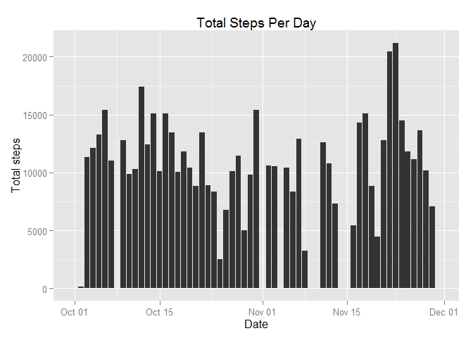
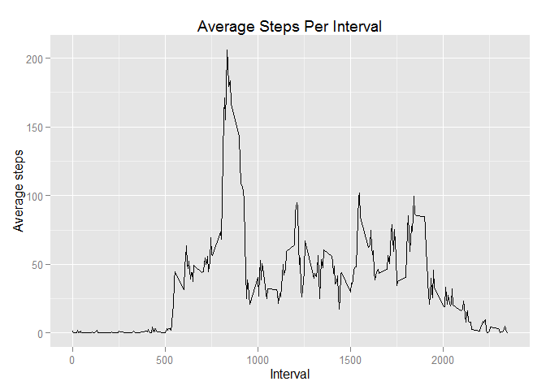
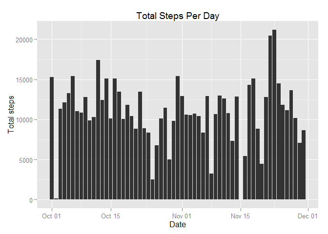
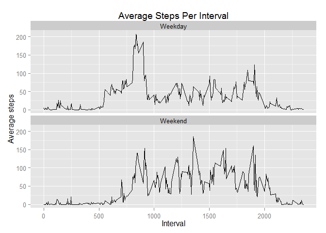

# Reproducible Research: Peer Assessment 1


## Loading and preprocessing the data

Show any code that is needed to

1. Load the data (i.e. read.csv())


```r
ActivityData <- read.csv("activity.csv")
```

2. Process/transform the data (if necessary) into a format suitable for your analysis


```r
library(plyr)

TotalStepsPerDay <- ddply(ActivityData,.(date), summarize, TotalSteps = sum(steps, na.rm=TRUE))

TotalStepsPerDay$date <- as.Date(TotalStepsPerDay$date, "%Y-%m-%d")
```

## What is mean total number of steps taken per day?

For this part of the assignment, you can ignore the missing values in the dataset.

1. Make a histogram of the total number of steps taken each day


```r
library(ggplot2)
```

```
## Warning: package 'ggplot2' was built under R version 3.1.2
```

```r
TotalStepsPerDayGraph <- ggplot(TotalStepsPerDay, aes(x = date, y = TotalSteps)) +
   geom_bar(stat="identity") +
   labs(title="Total Steps Per Day", x = "Date", y = "Total steps") 
 print(TotalStepsPerDayGraph)
```

 

2. Calculate and report the mean and median total number of steps taken per day


```r
MeanSteps <- mean(TotalStepsPerDay$TotalSteps)
MedianSteps <- median(TotalStepsPerDay$TotalSteps)
```

```
The mean is 9354.2295082 and the median is 10395.
```

## What is the average daily activity pattern?

1. Make a time series plot (i.e. type = "l") of the 5-minute interval (x-axis) and the average number of steps taken, averaged across all days (y-axis)


```r
AvgStepsPerInterval <- ddply(ActivityData, .(interval), summarize, AvgSteps = mean(steps, na.rm=TRUE))

AvgStepsPerIntervalGraph <- ggplot(AvgStepsPerInterval, aes(x = interval, y = AvgSteps)) +
  geom_line() +
  labs(title="Average Steps Per Interval", x = "Interval", y = "Average steps") 
print(AvgStepsPerIntervalGraph)
```

 

2. Which 5-minute interval, on average across all the days in the dataset, contains the maximum number of steps?


```r
IntervalWithMaxAvgSteps <- AvgStepsPerInterval$interval[which.max(AvgStepsPerInterval$AvgSteps)]
```

```
The 835 5-minute interval contains the maximum number of steps.
```

## Imputing missing values

Note that there are a number of days/intervals where there are missing values (coded as NA). The presence of missing days may introduce bias into some calculations or summaries of the data.

1. Calculate and report the total number of missing values in the dataset (i.e. the total number of rows with NAs)


```r
TotalMissingValues <- sum(is.na(ActivityData$steps))
```

```
The total number or missing values in the dataset is 2304.
```

2. Devise a strategy for filling in all of the missing values in the dataset. The strategy does not need to be sophisticated. For example, you could use the mean/median for that day, or the mean for that 5-minute interval, etc.


```r
library(mice)
```

```
## Warning: package 'mice' was built under R version 3.1.2
```

```
## Loading required package: Rcpp
```

```
## Warning: package 'Rcpp' was built under R version 3.1.2
```

```
## Loading required package: lattice
## mice 2.22 2014-06-10
```

```r
MICEActivityData <- mice(ActivityData)
```

3. Create a new dataset that is equal to the original dataset but with the missing data filled in.


```r
NewDataset <- complete(MICEActivityData)
```

4. Make a histogram of the total number of steps taken each day and Calculate and report the mean and median total number of steps taken per day.


```r
NewTotalStepsPerDay <- ddply(NewDataset, .(date), summarize, TotalSteps = sum(steps))

NewTotalStepsPerDay$date <- as.Date(NewTotalStepsPerDay$date, "%Y-%m-%d")

NewTotalStepsPerDayGraph <- ggplot(NewTotalStepsPerDay, aes(x = date, y = TotalSteps)) +
  geom_bar(stat="identity") +
  labs(title="Total Steps Per Day", x = "Date", y = "Total steps") 
print(NewTotalStepsPerDayGraph)
```

 


```r
NewMeanSteps <- mean(NewTotalStepsPerDay$TotalSteps)
NewMedianSteps <- median(NewTotalStepsPerDay$TotalSteps)
```

Do these values differ from the estimates from the first part of the assignment?

```
First Part of Assignment
Mean is 9354.2295082 and Median is 10395.

Second Part of Assignment
Mean is 1.0910361\times 10^{4} and Median is 10867.

Yes, these values differs.
```

What is the impact of imputing missing data on the estimates of the total daily number of steps?

```
The impact is that the Mean changes from 9354.2295082 to 1.0910361\times 10^{4}, and Median changes from 10395 to 10867, and there is an increase of 1556.1311475 to the Mean and 472 to the Median after the imputing of data.
```

## Are there differences in activity patterns between weekdays and weekends?

For this part the weekdays() function may be of some help here. Use the dataset with the filled-in missing values for this part.

1. Create a new factor variable in the dataset with two levels - "weekday" and "weekend" indicating whether a given date is a weekday or weekend day.


```r
NewDataset$DayType <- ifelse(weekdays(as.Date(NewDataset$date)) %in% c("Saturday", "Sunday"), "Weekend", "Weekday")
NewDataset$DayType <- as.factor(NewDataset$DayType)
```

2. Make a panel plot containing a time series plot (i.e. type = "l") of the 5-minute interval (x-axis) and the average number of steps taken, averaged across all weekday days or weekend days (y-axis). See the README file in the GitHub repository to see an example of what this plot should look like using simulated data.


```r
NewAvgStepsPerInterval <- ddply(NewDataset, .(interval, DayType), summarize, AvgSteps = mean(steps, na.rm=TRUE))

NewAvgStepsPerIntervalGraph <- ggplot(NewAvgStepsPerInterval, aes(x = interval, y = AvgSteps)) +
  geom_line() +
  facet_wrap( ~ DayType, ncol = 1) +
  labs(title="Average Steps Per Interval", x = "Interval", y = "Average steps") 
print(NewAvgStepsPerIntervalGraph)
```

 
